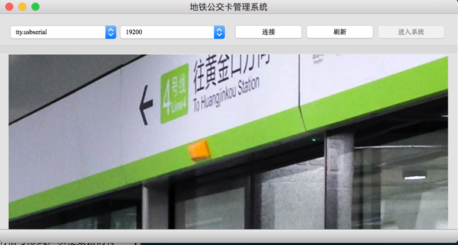
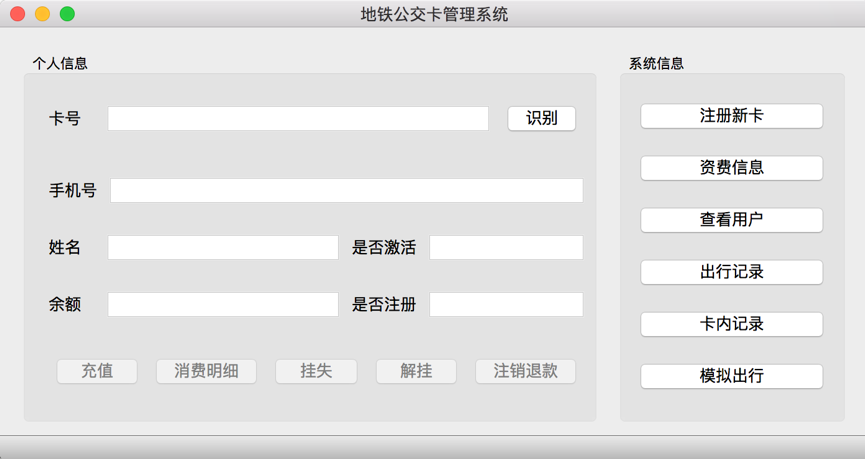
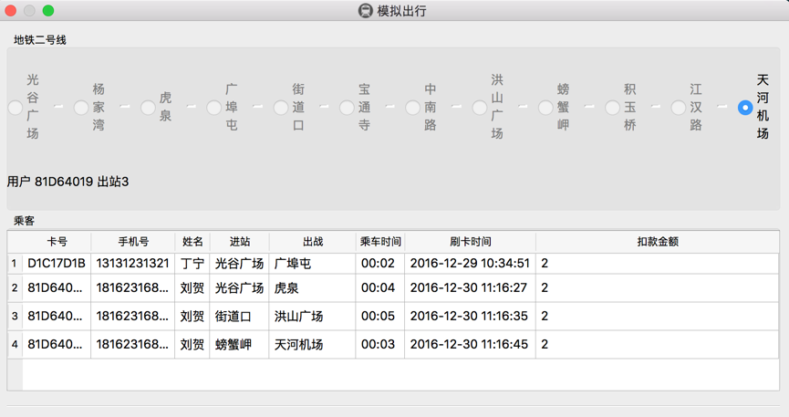
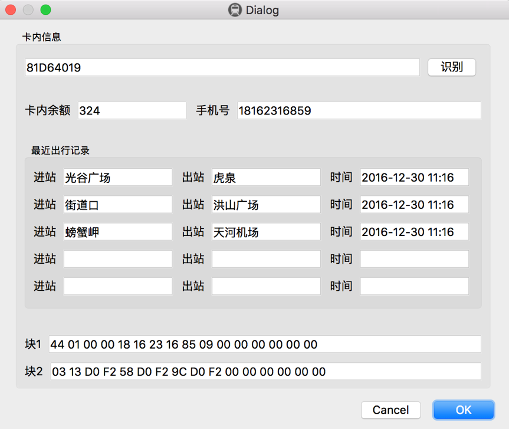

# RFID Subway Card Simulation System

This project implements an RFID subway card simulation system. Subway card is an electronic wallet useing radio frequency (RFID) technology, non-contact IC card as a transaction fee payment media. The goal of our system is making use of advanced computer networks, automatic control, information processing, communications and other technologies to establish a application system of the subway card's issuance, consumption and settlement.

The system is written in C++ with Qt5.


## Run

### With Qt Creator

Just double click file `Subway_System.pro` to load the project into Qt Creator and run in it.

### With command line

Requirements: `qmake, build-essentials`

```
qmake -makefile
make
```


## Usage

Choose the serial port and baud rate that connecting to the RFID reader and click button "连接". If the connection is established, you will be allowed to enter the system.



Entered the system, you can see the functions listed on the right and I believe you'll know how to use them.

* Home page



* Simulation Page



* Record Query Page



